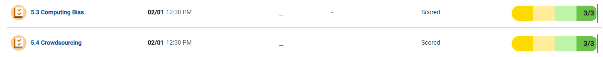

#CB 5.4/5.5 Notes and Quizzes

##5.3/5.4 quiz ss

Algorithms might also be trained on sets of data that aren't as diverse as they need to be. For example, facial recognition systems are often trained on data sets that contain fewer images of women and minorities than men in the majority.

Biases can be embedded at all levels of development, from the brainstorming phase to the work done after release.

Algorithms might also be trained on sets of data that aren't as diverse as they need to be. For example, facial recognition systems are often trained on data sets that contain fewer images of women and minorities than men in the majority.

Citizen science is a term that describes scientific research that the common population helps to conduct. Ordinary citizens help contribute data to research projects using computing devices. 

Crowdsourcing is the practice of getting a large amount of input or information from people on the Internet. Citizen science is an example of crowdsourcing, but crowdsourcing can also take other forms.

Crowdfunding sites like GoFundMe, Kickstarter, and Patreon allow people to raise money for all manner of causes, from creating works of art to (unfortunately) funding medical bills.

